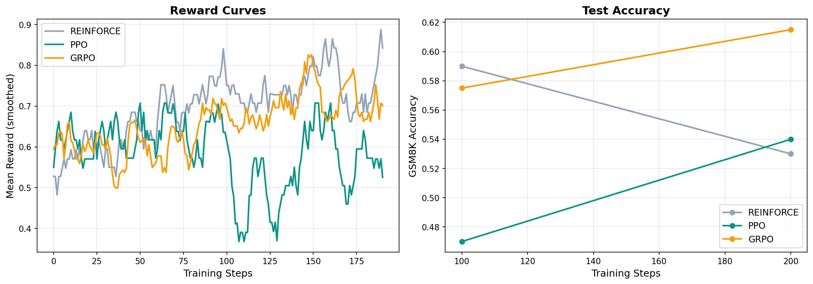

# RL for Mathematical Reasoning in Small Language Models

**COMP 4453 Course Project** — Ahmad Shaker, Abdullah Elganainy, Karim Abousamra

This project compares three reinforcement learning algorithms for improving mathematical reasoning in a small language model. We train Qwen2.5-1.5B-Instruct on the GSM8K benchmark using REINFORCE, PPO, and GRPO, with a rule-based reward function that requires no learned reward model.

## Results

All three algorithms improve over the base model's 50.5% accuracy after 200 training steps:

| Algorithm | Accuracy @ 100 | Accuracy @ 200 | Avg Reward | Time |
|-----------|---------------|---------------|------------|------|
| Baseline (no RL) | — | 0.505 | — | — |
| REINFORCE | **0.590** | 0.530 | 0.786 | 62 min |
| PPO | 0.470 | 0.540 | 0.571 | 63 min |
| GRPO | 0.575 | **0.615** | 0.764 | 72 min |

**GRPO wins.** It achieves the highest final accuracy (61.5%) without needing a critic network, making it the most practical choice under compute constraints. REINFORCE peaks early (59.0% at step 100) but drifts downward due to high gradient variance. PPO is volatile because our simplified EMA baseline undermines the trust-region stability its clipped surrogate is supposed to provide.



## How It Works

**Reward function** — Stepped rule-based scoring, no learned reward model:
- `+1.0` for correct final answer
- `+0.1` for wrong answer but well-structured reasoning with `####` delimiter
- `+0.02` for partial structure (reasoning OR delimiter, not both)
- `0.0` for incoherent output

**Model** — Qwen2.5-1.5B-Instruct with LoRA adapters (rank 16). Only 0.28% of parameters are trainable (4.4M out of 1.5B), so the whole thing fits in ~3.2 GB VRAM.

**Algorithms** — Each one applies a different policy gradient approach from the RL course:

- **REINFORCE** (Lecture 6): Vanilla policy gradient with an EMA baseline for variance reduction. Simple, fast, but high variance causes late-training drift.
- **PPO** (Lecture 7): Clipped surrogate objective enforces a trust region. Should be the most stable, but needs a proper critic to work well — our EMA substitute hurts it.
- **GRPO** (Shao et al., 2024): Samples K=4 responses per prompt, normalizes rewards within the group for advantages. No critic network, lower variance than REINFORCE, best final accuracy.

## Repository Structure

```
.
├── train_rl_math_final.ipynb   # Full training notebook (run this)
├── RL_Math_Reasoning_JMLR.pdf  # Project writeup / paper
├── comparison_plots.png        # Reward curves + accuracy plots
├── saved_models/               # LoRA checkpoints (created during training)
│   ├── reinforce_lora/
│   ├── ppo_lora/
│   └── grpo_lora/
└── README.md
```

## Quick Start

### Requirements

```
pip install torch transformers datasets peft bitsandbytes accelerate matplotlib tqdm
```

### Run Training

Open `train_rl_math_final.ipynb` in Jupyter or Google Colab and run all cells. The notebook handles everything: dataset loading, model setup, training all three algorithms, evaluation, and plotting.

**Hardware requirements:**
- GPU (recommended): NVIDIA GPU with 8+ GB VRAM. Training takes ~60 min per algorithm.
- CPU: Works but slower (~2-3 hours per algorithm). Reduce `NUM_TRAIN_STEPS` if needed.

### Configuration

Key settings are in cell 3 of the notebook. To adjust for your hardware:

| Setting | Default | What it does |
|---------|---------|-------------|
| `MODEL_NAME` | `Qwen/Qwen2.5-1.5B-Instruct` | Base model. Use `0.5B` for weaker hardware |
| `NUM_TRAIN_STEPS` | 200 | Steps per algorithm. More = better but slower |
| `BATCH_SIZE` | 4 | Prompts per step. Lower if you run out of memory |
| `GRPO_GROUP_SIZE` | 4 | Responses per prompt for GRPO |
| `EVAL_SAMPLES` | 200 | Test problems per evaluation checkpoint |
| `LEARNING_RATE` | 5e-5 | With 50-step warmup + cosine decay |

## Key Findings

1. **GRPO is the best algorithm for this setting.** It achieves the highest accuracy, needs no critic network, and has moderate training stability. Its group-relative advantage estimation provides more informative gradients than a single-sample EMA baseline.

2. **PPO needs a real critic to work properly.** The clipped surrogate is designed to work with accurate advantage estimates. Our EMA shortcut undercuts that, making PPO the most volatile of the three. A full actor-critic implementation would likely perform better.

3. **REINFORCE converges fastest but can't sustain it.** It hits 59% at step 100 before dropping to 53% by step 200. The high variance in vanilla policy gradients causes the policy to gradually drift away from good solutions.

4. **Rule-based rewards work.** We don't need a learned reward model for math. Binary correctness plus partial credit for structured reasoning gives enough signal to train effectively.

5. **RL works at small scale.** A 1.5B model with LoRA adapters, trained for 200 steps on a single GPU, goes from 50.5% to 61.5% on GSM8K. You don't need 70B parameters or a cluster.

## Connection to Course Material

| Concept | Lecture | Where it shows up |
|---------|---------|-------------------|
| Policy gradient theorem | Lecture 6 | REINFORCE update rule |
| Baselines for variance reduction | Lecture 6 | EMA baseline in REINFORCE |
| Actor-critic methods | Lecture 7 | PPO's value baseline |
| Trust regions / TRPO | Lecture 7 | PPO's clipped surrogate |
| Clipped surrogate objective | Lecture 7 | PPO implementation |
| Value function estimation | Lecture 7 | PPO advantage estimates |

GRPO extends these ideas by replacing the learned value function with group-level reward normalization, keeping the trust-region spirit (via KL penalty) without the memory cost.

## References

- Williams, R.J. (1992). *Simple Statistical Gradient-Following Algorithms for Connectionist Reinforcement Learning.* Machine Learning, 8(3-4).
- Schulman et al. (2017). *Proximal Policy Optimization Algorithms.* arXiv:1707.06347.
- Shao et al. (2024). *DeepSeekMath: Pushing the Limits of Mathematical Reasoning in Open Language Models.* arXiv:2402.03300.
- DeepSeek-AI (2025). *DeepSeek-R1: Incentivizing Reasoning Capability in LLMs via Reinforcement Learning.* arXiv:2501.12948.
- Cobbe et al. (2021). *Training Verifiers to Solve Math Word Problems.* arXiv:2110.14168.
- Wei et al. (2022). *Chain-of-Thought Prompting Elicits Reasoning in Large Language Models.* NeurIPS 2022.
- Ouyang et al. (2022). *Training Language Models to Follow Instructions with Human Feedback.* arXiv:2203.02155.
- Lightman et al. (2023). *Let's Verify Step by Step.* arXiv:2305.20050.
- Hu et al. (2021). *LoRA: Low-Rank Adaptation of Large Language Models.* arXiv:2106.09685.
